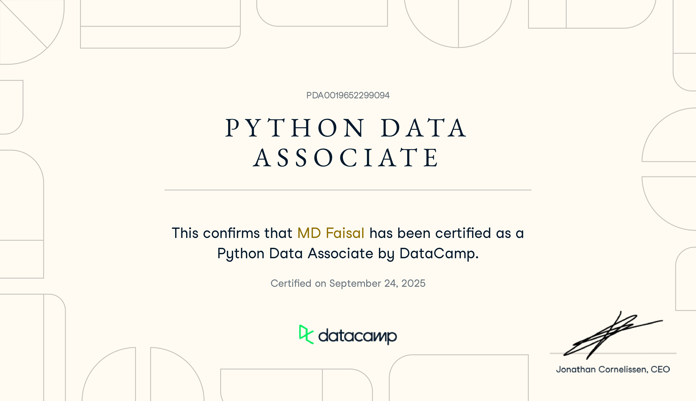

# 🐍 DataCamp – Python Data Associate Certification

This repository showcases my journey through the **DataCamp Python Data Associate Certification**, which validates my ability to manipulate, analyze, and visualize data using Python.

---

## 🧾 Certification Overview

- **Certificate:** DataCamp Python Data Associate  
- **Platform:** DataCamp  
- **Focus Areas:**
  - Data manipulation with `pandas`
  - Data visualization with `matplotlib` and `seaborn`
  - Exploratory Data Analysis (EDA)
  - Working with real-world datasets
  - Writing clean and efficient Python code

---

## 🧰 Technologies & Libraries

| Tool / Library | Purpose |
|-----------------|----------|
| Python | Core language |
| pandas | Data manipulation |
| NumPy | Numerical computation |
| Matplotlib | Data visualization |
| Seaborn | Statistical plotting |
| Jupyter Notebook | Interactive analysis |

---

## 📊 Key Skills Demonstrated

- Data Cleaning and Preprocessing  
- Exploratory Data Analysis (EDA)  
- Creating meaningful visualizations  
- Handling missing and categorical data  
- Grouping, merging, and aggregating data  
- Statistical insights and trend identification  

---

## 🧪 Projects Included

| Project | Description |
|----------|--------------|
| `project-1.ipynb` | Analyzing retail sales data using pandas and matplotlib |
| `project-2.ipynb` | Exploring movie datasets and visualizing trends |
| `project-3.ipynb` | Combining multiple data sources to extract insights |

*(You can rename or replace these with your actual DataCamp project files)*

---

## 🏅 Certificate

Here’s my official DataCamp Certificate:  
  
🔗 [View Credential on DataCamp](https://www.datacamp.com/statement-of-accomplishment)

---

## 📈 Example Output

*(Add one or two visualizations here)*  

---

## 💬 Author

**MD. Faisal**  
🎓 BSc in Physics | Aspiring Data Scientist  
🔗 [GitHub](https://github.com/mdfaisal) • [LinkedIn](https://linkedin.com/in/mdfaisal)  
📧 Email: yourname@example.com  

---

⭐ *If you found this project helpful or inspiring, please give it a star!*
